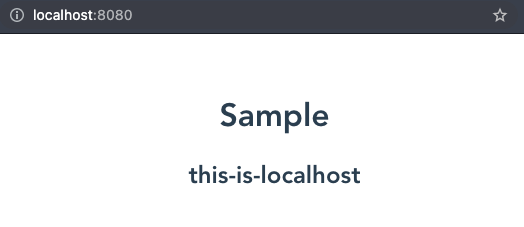

# resolvenv

A tool for static site applications that switches variables by deployment environment.

## Install

```sh
$ npm install resolvenv --save
```

## How to use

This is a sample code of Vue.js app.

```html
<template>
  <h1>Sample</h1>
  <h2>{{ envParameter }}</h2>
</template>

<script>
import { resolvenv, hostname } from "resolvenv";

export default {
  name: "App",
  data() {
    return {
      envParameter: null,
    };
  },
  mounted() {
    const envParams = [
      { env: hostname("localhost"), value: "this-is-localhost" },
      { env: hostname("dev-environment"), value: "this-is-dev-environment" },
      { env: hostname("prod-environment"), value: "this-is-prod-environment" },
    ];
    this.envParameter = resolvenv(envParams);
  },
};
</script>
```


